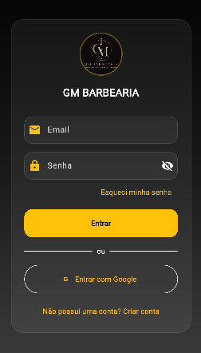
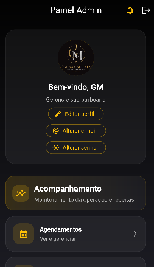
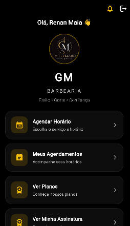

# 💈 Barbearia App

Aplicação desenvolvida para gerenciamento de agendamentos em barbearias, oferecendo uma experiência moderna tanto para clientes quanto para administradores.

O sistema foi desenvolvido com foco em praticidade, organização e experiência do usuário, permitindo controle completo dos horários, serviços e profissionais.

---

# 🚀 Funcionalidades

## 👤 Cliente
- Cadastro e login
- Agendamento de horários
- Escolha de barbeiro
- Seleção de serviços
- Visualização de horários disponíveis
- Histórico de agendamentos
- Interface responsiva e moderna

## 🛠️ Administração
- Gerenciamento de barbeiros
- Cadastro de serviços
- Controle de agendamentos
- Upload de imagens
- Painel administrativo
- Atualização de horários disponíveis

---

# 💻 Tecnologias Utilizadas

- Flutter
- Dart
- Firebase Authentication
- Cloud Firestore
- Firebase Storage
- Material Design

---

# 🔥 Recursos

- Autenticação de usuários
- Banco de dados em tempo real
- Upload e armazenamento de imagens
- Interface moderna e responsiva
- Integração com Firebase

---

# 📱 Objetivo do Projeto

O objetivo do projeto é facilitar o gerenciamento de agendamentos em barbearias, oferecendo praticidade para clientes e organização para os profissionais.

---

## 📸 Screenshots

  
  
  

---

# ⚙️ Como executar o projeto

- Clone o repositório
git clone <https://github.com/Gleicekeli12/barbearia_app.git>

- Acesse a pasta | cd barbearia-app

- Instale as dependências | flutter pub get

- Execute o projeto | flutter run

---

# 📫 Contato
- LinkedIn: <https://www.linkedin.com/in/gleice-keli/>
- E-mail: gleicekeli8474@gmail.com
